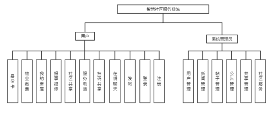
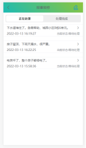
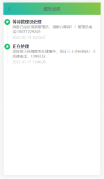
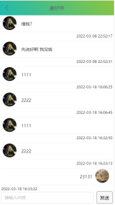
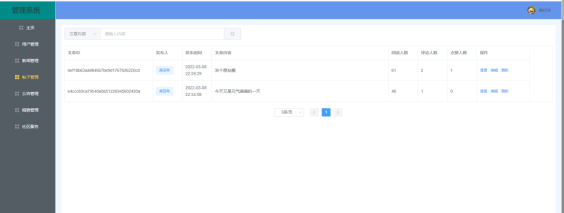
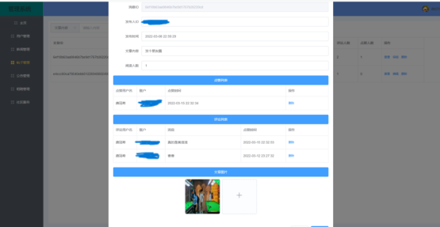

# 智慧社区服务端
## 智慧社区功能分析
* 社区：查看浏览新闻，身份卡、物业缴费、我的房屋、报事维修、社区共享、服务电话功能
* 生活：搜索帖子、发布帖子、在线聊天
* 我的：修改资料、我的房子、身份码

本系统主要前后端分离，后端使用springboot加mybatis-plus，前端web端使用vue加ElementUi，APP端使用了vue、uniapp、uview。

[系统后端项目地址](https://github.com/TangHaoShuai/IntelligentCommunity "后端")

[APP前端项目地址](https://github.com/TangHaoShuai/-IntelligentCommunity_App_Vue "App端")

[web管理员项目地址](https://github.com/TangHaoShuai/vue_demo "web管理员端")
#### 总体模块解构图

#### APP部分功能界面图
  

  

#### 管理员部分功能界面图

